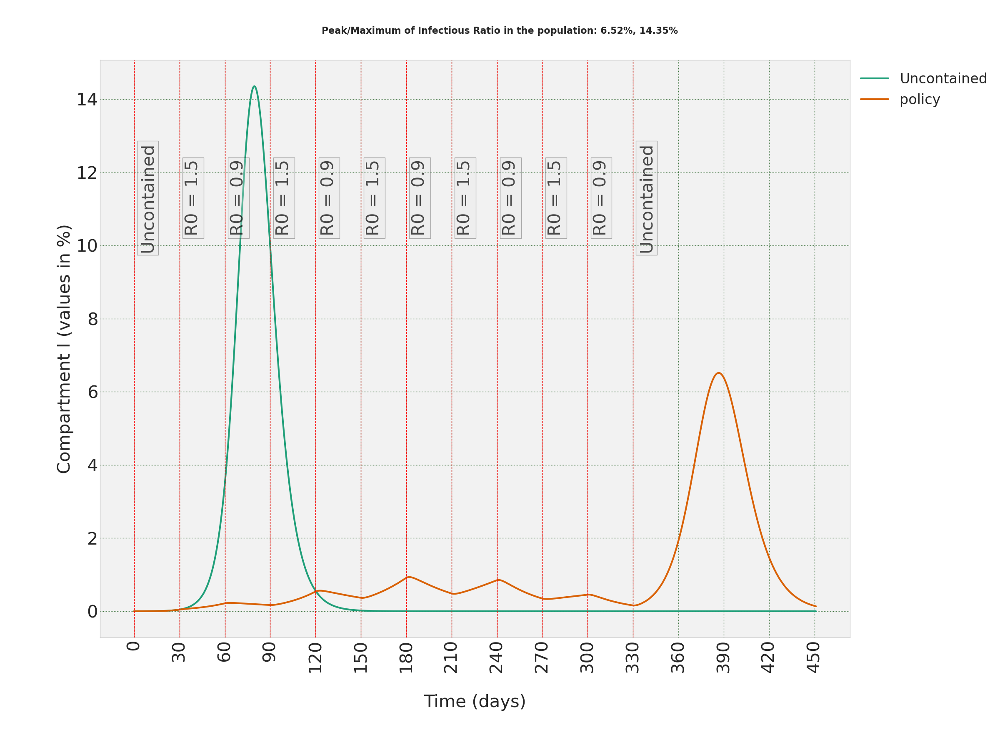
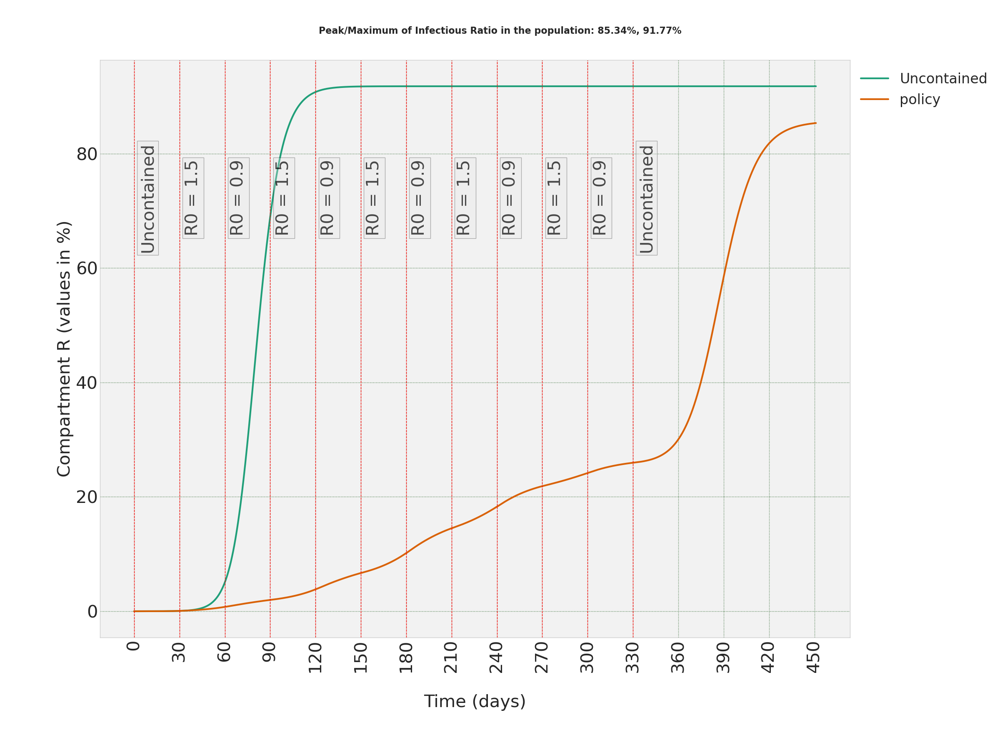
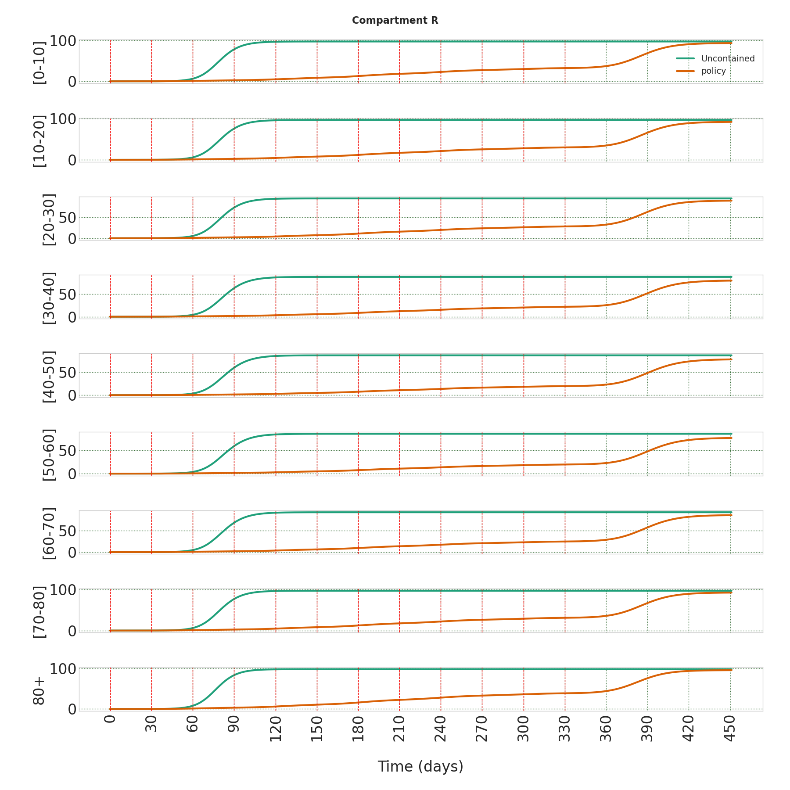

---
title: 'A Repository to Simulate the Spread of COVID-19 in any Population with a Known Age-Structure, Made in Tübingen.'
tags:
  - Python
  - Mathematical Epidemiology
  - Dynamical Systems
  - COVID-19
  - SARS-CoV-2
  - Compartmental Models
  - Nonlinear Systems
authors:
  - name: Vahid S. Bokharaie
    orcid: 0000-0001-6544-7960
    affiliation: "1" # (Multiple affiliations must be quoted)
affiliations:
 - name: Max Planck Institute for Biological Cybernetics, Tuebingen, Germany
   index: 1
date: 20 October 2020
bibliography: paper.bib
---

# Summary

The spread of viruses or any other sources of diseases in a population is a problem that has kept mathematicians and epidemiologists quite busy for decades. There have been various approaches to model the spread of any disease in a population. One that has proved quite effective while not overly complicated, is to use compartmental models. In such models, the population is divided into compartments, which represents the progress of the disease. Compartmental models are usually represented using a set of letters that capture different stages in the progress of that disease. For example, in a model called SEIR, the four compartments are Susceptible, S, which includes those who are healthy and can be infected; Exposed, E, those who are infected but not yet Infectious, Infectious, I, which includes those who are infected and can transmit the disease; and Removed, R, which includes those who were Infectious but no more. And the term SEIR shows the progress of the disease. If, for example, a virus does not have a latent period but infers immunity, we use SIR compartmental model. Or if the disease does not infer immunity, then SIS model is what we should use.

To make the models more accurate and useful, we can stratify the into various relevant groups, for example, age-groups. That is in particular relevant to COVID-19, since it is shown that it affects older people more severely. 

 
# Statement of need
`MiTepid_sim` is a repository to simulate the spread of COVID-19 in any population with a known age-structure, Made in Tuebingen. It makes simulation of the spread of COVID-19 in a population quite easy. 

What this library has to offer can be summarized as follows:

* The `MiTepid_sim` library simulates the dynamics of a stratified compartmental epidemiological model. A set of Ordinary Differential Equations (ODEs) is used as the mathematical basis for the model. Hence, the computational cost to run the simulations is that of a set of ODEs. Currently, SIS, SIR, and SEIR compartmental models are defined in the code, but the user can easily add any other model in the `models` module of the library.

* In order to make the code relevant to the spread of SARS-CoV-2 in a population and not simply a generic model,  `MiTepid_sim` comes with a set of contact rates that are obtained based on the available data on the spread of SARS-CoV-2 in a population. The mathematical basis of how these contact rates are calculated is explained in [@Bok2020a] and [@Bok2020b]. The contact rates are calculated assuming the population is stratified into nine age-groups, every 10 years and then 80+. The contact rates accompanying the code should be adapted based on the population density of each population in each age-group. The population distribution of some sample countries is already added to the `policies` module of the library. The user can easily add any other population of interest to the module. It is also possible to introduce any other set of contact rates defined by the user or change the number of age-groups or even stratify the population into different groups, for example, students, people who work, and people who do not work. How we group the population does not make any difference for the `MiTepid_sim` library. It only affects how we calculate contact rates. And calculating contact rates is out of the scope of this library. 

* The `MiTepid_sim` library allows us to study the effects of applying various containment policies to a given population. Such policies can affect each age-group differently and can vary in time.

* The library can also be used to study the effects of vaccination in a population and how wide-spread vaccination should be to achieve herd-immunity. The vaccinated population can be considered simply as initial values for the Recovered (R) compartment. And the code allows us to change the initial conditions in any arbitrary time-step of choice to emulate the gradual introduction of the vaccine in a population.

* The library comes with a set of visualizations tools that allows us to generate various plots necessary to study the effects of each policy in the evolution of the trajectories of different compartments. We can plot the trajectories per age group or as an aggregate for the whole population.

# Examples
There are a few scripts in the `examples` folder in the repository which can be used as examples of what the code can do. To see samples of the plots generated by the code, you can look at [@Bok2020a] and [@Bok2020b]. All the plots in these two manuscripts are generated using `MiTepid_sim`. As a simple example, you can look at the \ref{fig:SEIR_I_AGG} and \ref{fig:SEIR_R_AGG} that show the evolution of trajectories of Infectious and Recovered compartments when the containment policy includes switching between situations in which Basic Reproduction Ratio (R0) is either 0.9 or 1.5. We can also get the trajectories for each age-group, as can be seen in \ref{fig:SEIR_R_groups}.

{#fig:SEIR_I_AGG}

{#fig:SEIR_R_AGG}

{#fig:SEIR_R_groups}

# References

